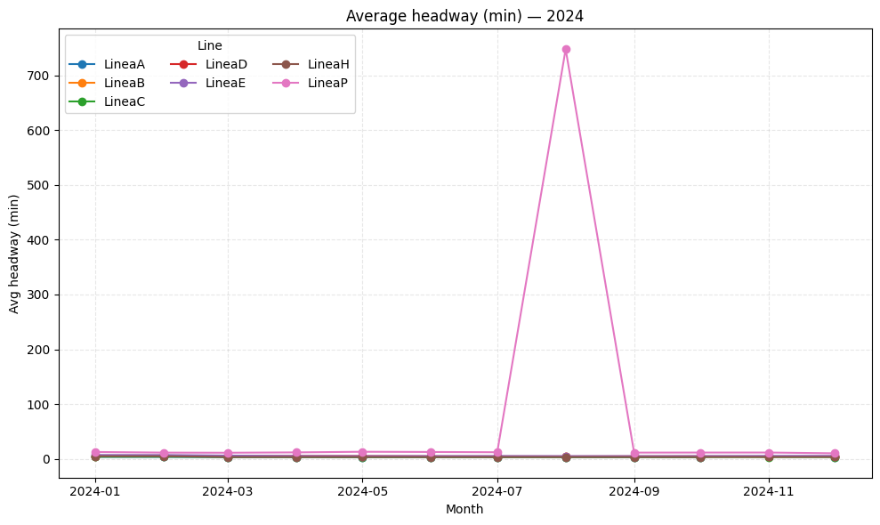
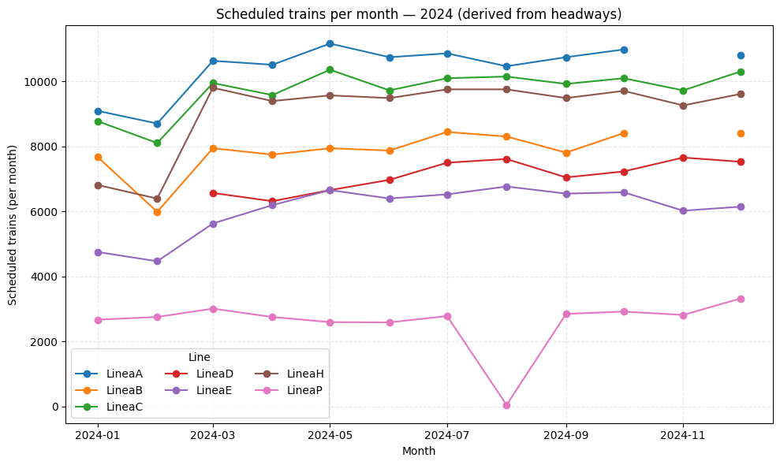

# 🚇 Buenos Aires Subway (Subte) — Business Intelligence Dashboard

**Goal:** Build an interactive BI dashboard that transforms official open data of the Buenos Aires Subway (Subte) into actionable insights for demand, frequency, and station-level patterns.

> This is a professional portfolio project designed to demonstrate data analysis, data modeling, geospatial visualization, and product-thinking. It follows a weekly iteration plan with public updates on LinkedIn.

---

## 🔍 Key Questions
- Which **lines and stations** have the highest passenger demand?
- How does **demand evolve over time** (month/season)?
- How does **service frequency** relate to demand (efficiency proxy)?
- What **geographical patterns** emerge (stations proximity, corridor usage)?

---

## 🧩 Datasets (Official Open Data — GCBA)
- **Passengers by station (turnstiles/molinete)** — demand by station & line  
- **Monthly frequency** — trains dispatched / service frequency  
- **Stations & entrances (geolocation)** — coordinates for mapping  
> Source portal: https://data.buenosaires.gob.ar/dataset/?q=subtes

*(Exact dataset links and data dictionaries will be documented in `/data/README_DATASETS.md` after download.)*

---

## 🛠️ Tech Stack
- **Python 3.11+**, **Pandas**
- **Plotly + Dash** (interactive app) / *(Tableau or Power BI optional for comparison screenshots)*
- **Jupyter Notebooks** (exploration & EDA)

---

## 📂 Repository Structure
subte-dashboard/
│── assets/
│ └── screenshots/
│── data/ # raw/ and processed/ will live here
│ └── README_DATASETS.md # source links, schema, refresh policy
│── notebooks/ # EDA, experiments, drafts
│ └── 01_exploration.ipynb
│── src/
│ ├── app.py # Dash entry point (MVP dashboard)
│ └── utils/ # helpers (loading, cleaning, mapping)
│── requirements.txt
│── README.md

---

## 📸 Screenshots & LinkedIn Updates

- **Week 1**  
  Initial EDA — passengers by line (sample of 3 CSVs).  
    
  👉 [LinkedIn Post](https://www.linkedin.com/posts/hermanschubert_dataanalytics-businessintelligence-python-activity-7365832932294381569-go3H?utm_source=share&utm_medium=member_desktop&rcm=ACoAAAggMogBjBE17nitimWMiApsgdQkRtJey-M)

---

## 📊 Week 2 — Demand & Trends

✅ Cleaned + normalized full 2024 dataset (11.4M rows)  
✅ Aggregations by subway line and by month  
✅ First visualizations exported with Kaleido  

### Key Outputs
- **Total Passengers by Line (2024)**  
  

- **Monthly Demand by Line (2024)**  
  

---

## 📍 Week 3 — Geospatial Join (Stations + Demand)

✅ Clean join between **station entrances** (bocas) and **2024 turnstile demand**  
✅ 100% station–line match after alias normalization (pair-specific overrides for tricky cases)  
✅ Map + CSV exports generated for dashboard and recruiters  

### Key Outputs
- **BA Subway — Demand by Station (2024)**  
  

### Files Produced
- `data/processed/stations_with_demand_2024.csv`  
- `data/processed/map_stations_demand_2024.png`  
- `assets/screenshots/week3_map.png` (for README/LinkedIn)  

**Tech notes**  
- Robust CSV loader with multi-encoding fallback (`utf-8-sig`, `utf-8`, `latin1`, `cp1252`)  
- Column normalization + alias strategy (global + pair-wise mapping)  
- Plotly/Mapbox (OpenStreetMap tiles) for reproducible maps  

---

## 📈 Week 4 — Frequency & KPI (Pax / Train)

This week we integrated **service frequency** (trains dispatched) to create a simple efficiency proxy:  
**KPI = Passengers / Dispatched Train** (by line & by month, 2024).

**What we did**
- Normalized monthly frequency from *Formaciones Despachadas 2024*.
- Rebuilt passengers trend (2024) robustly from turnstiles if not cached.
- Created KPI snapshots per line and a monthly trend.
- Exported ready-to-share **CSVs** and **PNGs**.

**Key outputs**
- `data/processed/kpi_pax_per_train_2024_by_line.csv`
- `data/processed/kpi_pax_per_train_2024_trend.csv`

**Visuals**
- KPI by Line (2024)  
  

- Monthly KPI Trend (2024)  
  

---

### Week 5 — Data Quality Checks

- Added a robust multi-CSV loader (24 files, 11.44M rows for 2024).
- Sanity checks:
  - **Nulls** in `passengers`
  - **Negative values**
  - **Per-line extreme outliers** (above the 99.9th percentile)
  - **Duplicates** on (`station`, `line`, `date`)
- Exported anomalies to: `data/processed/quality_flags.csv`
- Distribution chart (boxplot, 15-min intervals) saved to:
  `assets/screenshots/week5_quality.png`

**Dataset scope (2024):**
- Date range: 2024-01-01 → 2024-12-31  
- Unique lines: 6  
- Unique stations: 97  
- Rows: 11,440,440  

**Coverage checks (monthly):**
- Low-coverage detection per (`station`, `line`, `month`)
- Reports saved to:  
  - `data/processed/quality_coverage_monthly.csv`  
  - `data/processed/quality_coverage_worst_cases.csv`  
- Heatmap saved to: `assets/screenshots/week5_quality.png`

_Screenshots:_  
  


---

### Week 6 — Dash MVP (Overview, Geospatial & KPIs)

- **Dash app** with three pages: Overview, Geospatial, and KPIs.
- **Overview:** total demand and monthly trends by line (2024).
- **Geospatial:** station map with 2024 passenger totals (via `stations_geo.csv`).
- **KPIs:** *Passengers per dispatched train* using `formaciones_2024`.

**Reproducible scripts (`/scripts`):**
- `generate_stations_geo.py` — build `data/processed/stations_geo.csv` from the raw “bocas/estaciones” file.
- `build_formaciones_from_freq.py` — derive `formaciones_2024.(csv|parquet)` from `freq_from_form_2024.csv`.
- `generate_formations_2024.py` — generic converter for raw formations (kept for future updates).
- `make_week6_screenshots.py` — exports the images used below.

**Screenshots:**
  
  
  


---

### Week 7 — Formations ETL & KPIs

- Ingested and normalized the official 2024 *dispatched formations* (.xlsx → `data/processed/formaciones_2024.(csv|parquet)`).
- Updated Dash KPI **Passengers per dispatched train** to use the official source (with a resilient fallback).
- Added two visuals:
  - **By line** (2024 aggregate): `assets/screenshots/week7_kpi_pax_per_train_by_line.png`
  - **Monthly trend** (all lines): `assets/screenshots/week7_kpi_pax_per_train_trend.png`

**Notes:**
- Premetro (*LineaP*) is currently excluded from KPIs to keep comparability across subway lines (will be integrated in a future sprint).
- All assets are centralized under `assets/screenshots/` to avoid duplicated paths under notebooks.

---

### 🗓️ Week 8 – Service Schedule & Headway Analysis

In this sprint, the dataset `frecuencia_subte.xlsx` was processed to estimate the **average headway per line** and derive the **scheduled number of trains per month**.  
A new dataset `headway_to_schedule_2024.csv` was created, now integrated into the processed data pipeline.

**Key deliverables:**
- ETL notebook: `notebooks/08_schedule_etl.ipynb`
- Processed dataset: `data/processed/headway_to_schedule_2024.csv`
- New loader in `utils.py`: `load_schedule()`
- Visual summaries saved under:
  - `assets/screenshots/week8_headway_trend.png`
  - `assets/screenshots/week8_scheduled_by_line.png`

_Screenshots:_  
  

---

## 📊 Dash App — Subte Dashboard

In addition to the weekly notebooks, this repository includes an interactive application built with Dash, featuring multiple pages (Overview, Geospatial, KPIs).

👉 [Instructions to launch the app](app/README.md)

---

## 🚀 Getting Started (Local)
```bash
git clone https://github.com/dochronos/subte-dashboard.git
cd subte-dashboard

# Create and activate venv
python -m venv venv
# Mac/Linux
source venv/bin/activate
# Windows
venv\Scripts\activate

# Install deps
pip install -r requirements.txt

# Run Dash app
python src/app.py
# App will run at http://127.0.0.1:8050

🧪 Data Quality & Refresh

Version datasets in /data/raw and /data/processed

Track refresh policy and caveats in README_DATASETS.md

📸 Screenshots (to be added)

/assets/screenshots/ — add key views

🔗 LinkedIn Updates

Weekly posts summarizing progress, insights, visuals, and tech decisions.

---

## 🗓️ Development Timeline (Weeks 1–8)

| Week | Focus | Main Deliverables |
|------|--------|------------------|
| **Week 1** | Project setup & ETL base | Defined data structure, created initial pipeline to clean open subway data |
| **Week 2** | KPI generation | Built first operational KPIs per subway line (frequency, service, coverage) |
| **Week 3** | Dashboard UI | Designed Streamlit dashboard layout and integrated KPI visualizations |
| **Week 4** | Geo & mapping integration | Linked station coordinates with line routes and added geographic analytics |
| **Week 5** | Coverage metrics | Generated visual coverage indicators for monthly service distribution |
| **Week 6** | Data normalization | Improved data structure, consolidated scripts, and automated data generation |
| **Week 7** | Official formations comparison | Cross-validated internal KPIs with official formation dispatch data (including Premetro) |
| **Week 8** | Service schedule analysis | Added official headway (frequency) datasets, created schedule-based KPIs and charts |

---

## 📊 Retrospective (Weeks 1–8)

After two months of continuous iteration, **Subte-Dashboard** achieved a full analytical cycle — from data ingestion to visual reporting — using real open data from Buenos Aires’ subway network.

**Key achievements:**
- Implemented a consistent **ETL pipeline** for raw and processed data.  
- Built a modular Streamlit dashboard with automated monthly KPI updates.  
- Integrated **geo-spatial visualizations** for stations and service lines.  
- Validated data against **official formation dispatch records (SBASE 2024)**.  
- Added new metrics based on the **service schedule (frequencies & headways)**.  

This stage closes with a mature, production-ready analytical platform capable of visualizing operational insights across multiple data sources.

---

## 🔗 Evolution → Urban Intelligence Lab

Subte-Dashboard now completes its standalone phase.  
Starting in **August 2025**, this project evolves — together with **AI-Automation Workflow** — into a unified ecosystem:  
> **Urban Intelligence Lab** — *where Business Intelligence meets AI and Automation.*

In this new phase, the dashboards and ETL models developed here will connect to automated workflows, forming an integrated environment for **urban data intelligence**.

Stay tuned for **Week 1 of Urban Intelligence Lab**, launching next week. 🚀

---

### 📸 Key Visuals
- `assets/screenshots/week8_headway_trend.png` — Monthly trend of average headways per line  
- `assets/screenshots/week8_scheduled_by_line.png` — Estimated number of scheduled trains per line

---

> 🗃️ **Repository status:**  
> As of October 2025, this project has been archived to preserve its full analytical cycle.  
> Active development continues in the unified repository: **[Urban Intelligence Lab](https://github.com/dochronos/urban-intelligence-lab).

---

📜 License

Open for educational and portfolio purposes. Data © Gobierno de la Ciudad de Buenos Aires (per their open-data license).

## 📌 Notes

This project is part of a professional growth journey, showcasing data-driven skills and technical learning.